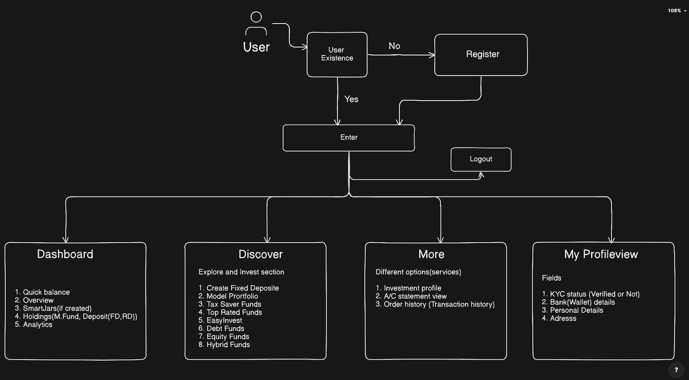

# SmartWealth – A Goal-Based Investment & Wealth Management Platform

  

**Status:** Under Development  
**Domain:** FinTech / Wealth Management  
**Architecture:** Monolithic (Spring Boot)

SmartWealth is a backend system designed to simplify personal finance and investment management.  
The project focuses on solving real, everyday investment problems faced by individuals and families by providing a secure, centralized, and intelligent investment platform.

---

## Why SmartWealth?

### 1. Lack of Centralized Investment Management

**Pain Point**  
Investments are spread across multiple banks, apps, and manual records. There is no single place to view the complete financial picture. Users struggle to track portfolio performance, manage family investments, and make informed decisions due to scattered data.

**Solution**  
SmartWealth provides a unified investment dashboard where all investments can be viewed, tracked, and analyzed in one place.

---

### 2. Want to Invest, but Don’t Know Where

**Pain Point**  
Many people want to invest but lack financial knowledge and clarity about suitable investment options. Overwhelming choices and unclear risk understanding lead to random investments or complete inaction.

**Solution**  
SmartWealth offers guided, data-driven investment recommendations (such as SIPs, FDs, gold, silver, etc.) based on user risk profile and financial goals.

---

## Core Features

### Investment Management
- Place and manage investments across multiple instruments:
    - Mutual Funds (SIP / Lump Sum)
    - Fixed Deposits
    - Gold and Silver
- Automated SIP execution
- Complete transaction history with audit tracking

### Goal-Based Planning
- Create financial goals (Home, Education, Retirement, Marriage, etc.)
- Link investments to specific goals
- Track goal progress in real time
- Goal-aligned investment recommendations

### Smart Recommendations
- User risk profiling:
    - Conservative
    - Moderate
    - Aggressive
- Investment suggestions based on:
    - Risk appetite
    - Time horizon
    - Financial goals

### Portfolio Analytics
- Consolidated portfolio overview
- Asset allocation analysis (Equity, Debt, Commodities)
- Performance tracking over time

### Security & Compliance
- Secure authentication and authorization
- Transaction integrity and audit logs
- Industry-standard backend practices

---

## How SmartWealth Solves the Problem

SmartWealth combines centralized data management with intelligent decision support.  
Instead of users managing multiple apps and making uninformed choices, the platform brings everything together and guides users toward structured, goal-oriented investing.

---

## Application Flow & User Journey

  

---

## Roadmap

SmartWealth is being developed in structured phases following real-world fintech and enterprise standards.

### Phase 1: Foundation & Authentication
- Spring Boot project setup with PostgreSQL and Flyway
- Secure authentication using JWT (access & refresh tokens)
- Global exception handling and base security configuration

### Phase 2: User & Profile Management
- User registration with customerId-based identity
- Secure profile management
- Login tracking and basic user lifecycle handling

### Phase 3: KYC & Risk Profiling
- KYC workflow with status transitions
- Questionnaire-based risk profiling (Conservative / Moderate / Aggressive)

### Phase 4: Wallet & Transactions
- One wallet per user
- Secure credit/debit transactions
- Idempotent transaction handling for fintech safety

### Phase 5: Investments
- Mutual fund catalog (read-only)
- SIP creation and management
- User investment holdings and return calculations

### Phase 6: Goal-Based Investing (Smart Jars)
- Financial goal creation
- Investment-to-goal mapping
- Goal progress tracking and recommendations

### Phase 7: Analytics & Reporting
- Portfolio summary and asset allocation
- Transaction reports and history APIs

### Phase 8: Security Hardening
- Refresh token rotation
- Account locking and brute-force protection
- Advanced security validations

### Phase 9: Testing & Documentation
- Unit and integration tests
- Swagger / OpenAPI documentation
- Clear API contracts

### Phase 10: Production Readiness
- Structured logging and error standardization
- Environment profiles (dev / test / prod)
- Docker support (optional)

---

## Contact & Suggestions

**Parth Dabhi**
- **GitHub:** https://github.com/parth-dabhi
- **LinkedIn:** https://www.linkedin.com/in/parthdabhi
- **Email:** parthdabhi2006@gmail.com

I’m open to suggestions, feedback, and collaboration ideas.  
If you have thoughts on improving SmartWealth, feel free to reach out.

---

> **Note**  
> This is an educational project created to demonstrate enterprise-level backend development practices, including clean architecture, design patterns, caching strategies, scheduled jobs, third-party integrations, and comprehensive testing.